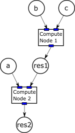
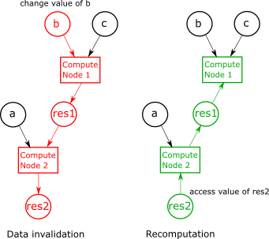

.. SPDX-FileCopyrightText: 2026 Jan Kleinert <jan.kleinert@dlr.de>
..
.. SPDX-License-Identifier: Apache-2.0

.. toctree::
   :maxdepth: 2

.. _concepts:

Design concept
==============

Parametric combines three concepts to make parametric computation possible:
 
 - **Lazy evaluation**: it allows to defer a potentially expensive computation to a point when it is actually needed
 - **Caching**: Once a computation has been executed, the result is cached such that a new computation is not required anymore.
 - **Data invalidation**: Whenever some input data of a computation was changed, all dependent results will be invalidated, i.e.
   their cache is cleared.

To enable the parametric evalution, a directed acyclic graph (DAG) is generated that tracks the
data flow through the different computations. This graph includes *parameters* and *compute nodes*.
Parameters are either values set by a user or are the result of a computation.
Compute nodes can have mulitple input and output parameters. A small parametric graph could look as follows:

In this figure, parameters are visualized as circles, compute nodes as boxes. The small blue rectangles of each
compute node are so called *output parameters*, which hold a reference to each output.

Parameters are realized by the class ``parametric::param``. A parameter object contains

 - One or zero values to its wrapped type. If no value is stored, the parameter is called *invalid*.
 - If the parameter is a result of a computation, it stores a pointer to the compute node that is responsible for computing its value. 

Change of parameter
-------------------

The power of parametric is the tracking of data change. If a parameter is changed, it will be invalidated, i.e.
its value is deleted. In addition, the parameter invalidates all dependent compute nodes, which again invalidate
their results. The next image shows the process of data invalidation.

After flooding the invalitation flag (red) through the DAG, also the resuling node (res2) is invalid and its value is deleted.
When the value of an invalidated node is accessed, all invalidated compute nodes are executed to perform their calculations.
If for example parameter a has changed, only `compute node 2` had to be executed again, as `res1` would still be valid.
This ensures, that only a minimum amount of computations is performed to get the resulting value.

Ownership
---------

Each node of the compute graph has pointers to their child and parents. In the current implementation,
**a child owns its parents**. This ensures that as long we have a pointer to a resulting value,
the whole graph to compute its value is kept alive.
When a parameter is freed / leaves the current scope, the all upstream nodes of the graph are deleted 
that are not referenced by another parameter anymore.